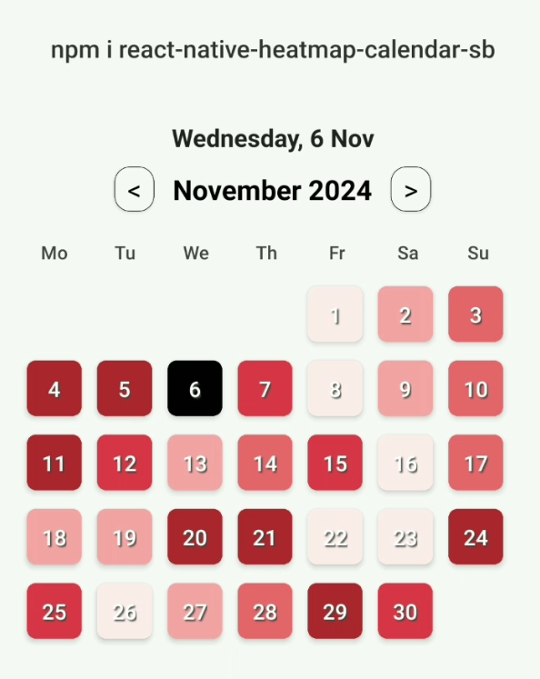
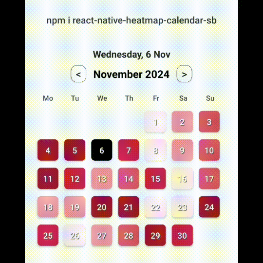

# React Native Heatmap Calendar SB





React Native calendar heatmap component designed for visualizing daily data trends and patterns with ease. This customizable component provides an intuitive way to represent each day’s data intensity using color gradients, making it ideal for tracking patterns, activity levels, or metrics over time. Whether you’re monitoring engagement levels, productivity, or any recurring events, the calendar offers a visual overview of fluctuations across days of the month.

With configurable colors, border styles, and text options, this component allows you to tailor the heatmap’s appearance to match your app's design and branding. Each day’s color shade represents the relative data level for that day, helping users quickly spot trends, high-activity days, and low periods in the calendar view. This heatmap calendar is perfect for applications that benefit from clear visual insights, enabling users to make data-driven decisions by recognizing patterns at a glance.

## Features

- Displays patterns by day in a month view
- Customizable color shades for different booking levels
- Highlights today's date and selected date with custom styles
- Easy navigation between months

## Installation

Install the package via npm:

```bash
npm install react-native-heatmap-calendar-sb
```

## Peer Dependencies

This package requires the following dependencies:

```json
"react": ">= 16.x.x",
"react-native": ">= 0.55.x",
"moment": ">= 2.24.0"
```

Make sure these dependencies are installed in your project.

## Usage

### Importing the Component

Import the `HeatmapCalendar` component in your React Native file:

```javascript
import HeatmapCalendar from 'react-native-heatmap-calendar-sb';
```

### Basic Example

Use the component by passing in required props, such as `dailyBookingPercentages` for booking data, `colors` for color shades, and other customizable styling options:

```javascript
const dailyBookingPercentages = [5, 20, 40, 80, 100, 0, 60, 10, 30, 50, 90, 75, 20, 45, 65, 10, 55, 25, 35, 85, 95, 15, 5, 90, 70, 0, 30, 45, 100, 60];

<HeatmapCalendar
  dailyBookingPercentages={dailyBookingPercentages} // array of percentages per day
  colors={['#e0f7fa', '#b2ebf2', '#80deea', '#4dd0e1', '#26c6da']} // color gradient based on percentages
  todayBackgroundColor="#FFD700" // custom color for today's background
  borderStyle={{ borderColor: '#000', borderWidth: 2 }}
  textColor="#333" // color of dates
  todayTextColor="#fff" // text color for today's date
/>
```

### Props

| Prop                 | Type        | Description                                                                                      |
|----------------------|-------------|--------------------------------------------------------------------------------------------------|
| `dailyBookingPercentages` | `Array<number>` | Array representing percentages for each day of the month.                                 |
| `colors`             | `Array<string>` | Array of colors representing different levels of booking, used for shading.                    |
| `todayBackgroundColor` | `string`   | Background color for today's date.                                                              |
| `borderStyle`        | `object`    | Styling for the border around today's date.                                                     |
| `textColor`          | `string`    | Default color for day text.                                                                     |
| `todayTextColor`     | `string`    | Text color for today's date.                                                                    |

### Example with Custom Colors and Styling

```javascript
<HeatmapCalendar
  dailyBookingPercentages={[10, 30, 60, 90]}
  colors={['#f0f8ff', '#a2d5f2', '#07689f', '#001f3f']}
  todayBackgroundColor="#FFD700"
  borderStyle={{ borderColor: '#000', borderWidth: 1 }}
  textColor="#333"
  todayTextColor="#fff"
/>
```

## Credits

Inspired by GitHub's commit calendar heatmap and other similar calendar heatmap libraries.

## License

This package is available under the MIT license. See the LICENSE file for more information.

---

### Author

**Saurabh Bhaskar**